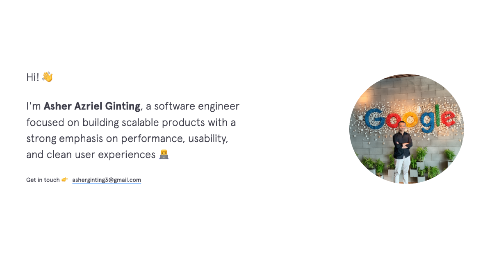

# AAG — Personal Portfolio

<p align="center">
  <a href="https://asherginting.me"></a>
</p>

<p align="center">
  A modern, performance-focused personal portfolio built with <b>Next.js 16</b> and <b>React 19</b>.<br/>
  Showcasing my work, experience, and technical skills as a software engineer.
</p>

<p align="center">
  <a href="https://nextjs.org"></a>
  <a href="https://react.dev"></a>
  <a href="https://www.typescriptlang.org"></a>
  <a href="https://tailwindcss.com"></a>
  <a href="./LICENSE"></a>
</p>

<p align="center">
  <a href="#-live">Live</a> ·
  <a href="#-features">Features</a> ·
  <a href="#-tech-stack">Tech Stack</a> ·
  <a href="#-getting-started">Getting Started</a> ·
  <a href="#-customizing-the-content">Customize</a> ·
  <a href="#-license">License</a>
</p>

---

## 🌐 Live

* **Website**: https://asherginting.dev
* **Repository**: https://github.com/asherginting/v3.asherginting

> Open to remote opportunities — available for global collaboration.

---

## ✨ Features

* ⚡ Built with **Next.js 16** (App Router + Turbopack)
* ⚛️ Powered by **React 19**
* 🎨 Minimalist UI with custom typography (Apercu)
* 🌗 Light / Dark mode with system-preference support
* 🎞️ Smooth animations using Framer Motion
* 📱 Fully responsive across all devices
* 🧩 Scalable, modular, data-driven architecture
* 🚀 Optimized for performance, SEO, and accessibility

---

## 🧱 Tech Stack

| Category   | Technology          |
| ---------- | ------------------- |
| Framework  | Next.js 16          |
| UI Library | React 19            |
| Language   | TypeScript          |
| Styling    | Tailwind CSS v4     |
| Animation  | Framer Motion       |
| Theme      | next-themes         |
| Fonts      | Local font (Apercu) |
| Linting    | ESLint              |
| Deployment | Vercel              |

---

## 📂 Project Structure

```bash
src/
├── app/            # App Router (layout, pages, providers, routes)
│   └── contact/    # /contact route
├── components/     # Reusable UI components
├── data/           # Content as JSON (single source of truth)
├── fonts/          # Local font assets (Apercu)
└── icons/          # Custom icon components

public/
├── projects/       # Project images
├── og-image.png    # Social share / preview image
├── profile.jpg
├── resume.pdf
└── robots.txt
```

---

## 🚀 Getting Started

### Prerequisites

* **Node.js** `>= 20` (Next.js 16 requirement)
* **pnpm** `>= 9` — install with `npm install -g pnpm`

### Installation

```bash
# 1. Clone the repository
git clone https://github.com/asherginting/v3.asherginting.git
cd v3.asherginting

# 2. Install dependencies
pnpm install

# 3. Start the development server
pnpm dev
```

Open [http://localhost:3000](http://localhost:3000) in your browser.

### Scripts

| Command       | Description                          |
| ------------- | ------------------------------------ |
| `pnpm dev`    | Start the development server         |
| `pnpm build`  | Create an optimized production build |
| `pnpm start`  | Run the production build locally     |
| `pnpm lint`   | Run ESLint                           |

---

## 🛠️ Customizing the Content

All content is **data-driven** — you can fork this project and make it your own without touching the components. Edit the JSON files in [`src/data/`](./src/data):

| File              | Controls                          |
| ----------------- | --------------------------------- |
| `contact.json`    | Contact links (email, social…)    |
| `experience.json` | Work experience timeline          |
| `projects.json`   | Featured projects                 |
| `skills.json`     | Technical skills                  |
| `footer.json`     | Footer content                    |

Replace assets in [`public/`](./public) (e.g. `profile.jpg`, `resume.pdf`, `og-image.png`, and images under `public/projects/`) to match your own profile.

---

## ☁️ Deployment

The easiest way to deploy is with [**Vercel**](https://vercel.com) (the platform from the creators of Next.js):

1. Push your fork to GitHub.
2. Import the repository into Vercel.
3. Vercel auto-detects Next.js — no extra configuration required.

You can also deploy to any platform that supports Node.js by running `pnpm build` followed by `pnpm start`.

---

## 📄 License

Distributed under the **MIT License**. See [`LICENSE`](./LICENSE) for more information.

You are free to fork and adapt this project for your own portfolio — a star ⭐ or attribution is appreciated but not required.

---

## 📬 Contact

* **Email**: [asherginting3@gmail.com](mailto:asherginting3@gmail.com)
* **GitHub**: [@asherginting](https://github.com/asherginting)
* **LinkedIn**: [in/asherginting](https://www.linkedin.com/in/asherginting)

---

<p align="center">If you find this project useful, consider giving it a ⭐ — it helps a lot!</p>
